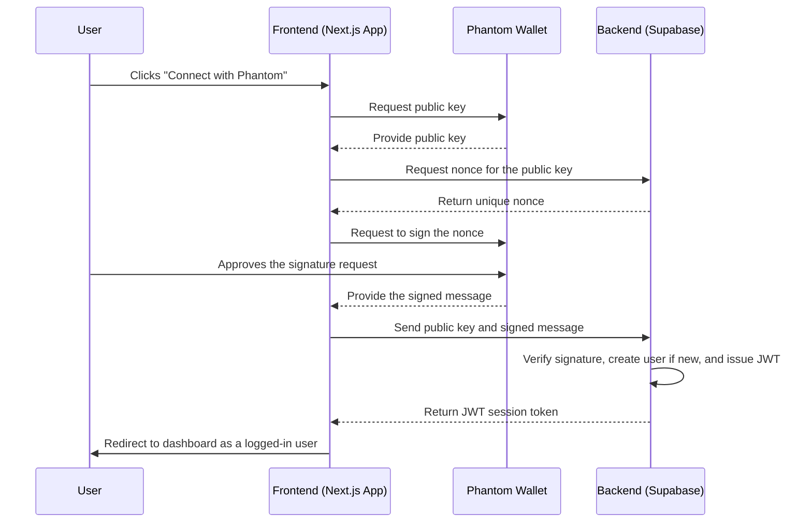

# Web3 Wallet (Solana) Authentication Integration Plan

## 1. Architecture Overview

This document outlines the plan to integrate Web3 wallet authentication using Solana and Phantom into the existing application. The primary goal is to add this new login method without disrupting the current email/password and Google authentication flows.

We will implement a "Sign-In with Solana" (SIWS) flow, which is a standard, secure method for authenticating users. The process is as follows:

1.  **Frontend:** The user clicks a "Connect with Phantom" button.
2.  **Frontend:** The app connects to the user's Phantom wallet to get their public key.
3.  **Backend (Supabase):** The frontend requests a unique, secure message (a "nonce") from our backend, which is associated with the user's public key.
4.  **Frontend:** The user is prompted to sign this unique message with their Phantom wallet. This proves they own the wallet.
5.  **Backend (Supabase):** The signed message and the user's public key are sent to Supabase's `signInWithIdToken` method. Supabase verifies the signature, and if valid, it creates a new user session and returns a JWT, logging the user in. A new user will be created in Supabase's `auth.users` table automatically on the first successful login.

## 2. Proposed Architecture Diagram

## 3. Required Changes

### Frontend (`frontend/` directory)

1.  **Install Dependencies:** The following `npm` packages will be installed:
    *   `@solana/wallet-adapter-react`
    *   `@solana/wallet-adapter-react-ui`
    *   `@solana/wallet-adapter-phantom`
    *   `@solana/web3.js`
    *   `bs58`

2.  **Create Wallet Context Provider:** A new React context provider (`WalletContextProvider.tsx`) will be created to wrap the application and manage wallet state.

3.  **Update Auth Page (`page.tsx`):**
    *   A "Connect with Phantom" button will be added to the UI as a primary login option.
    *   This button will trigger the wallet connection and sign-in flow.

4.  **Update Auth Logic (`actions.ts`):**
    *   A new server action, `signInWithSolana`, will be created to handle the SIWS flow with Supabase.

### Backend (Supabase)

1.  **Enable Solana Auth:** The "Enable Sign in with Solana" option must be activated in the Supabase project's authentication settings.
2.  **Database:** No manual schema changes are required. Supabase will automatically handle user creation and linking the Solana public key to the user's identity in the `auth.identities` table.